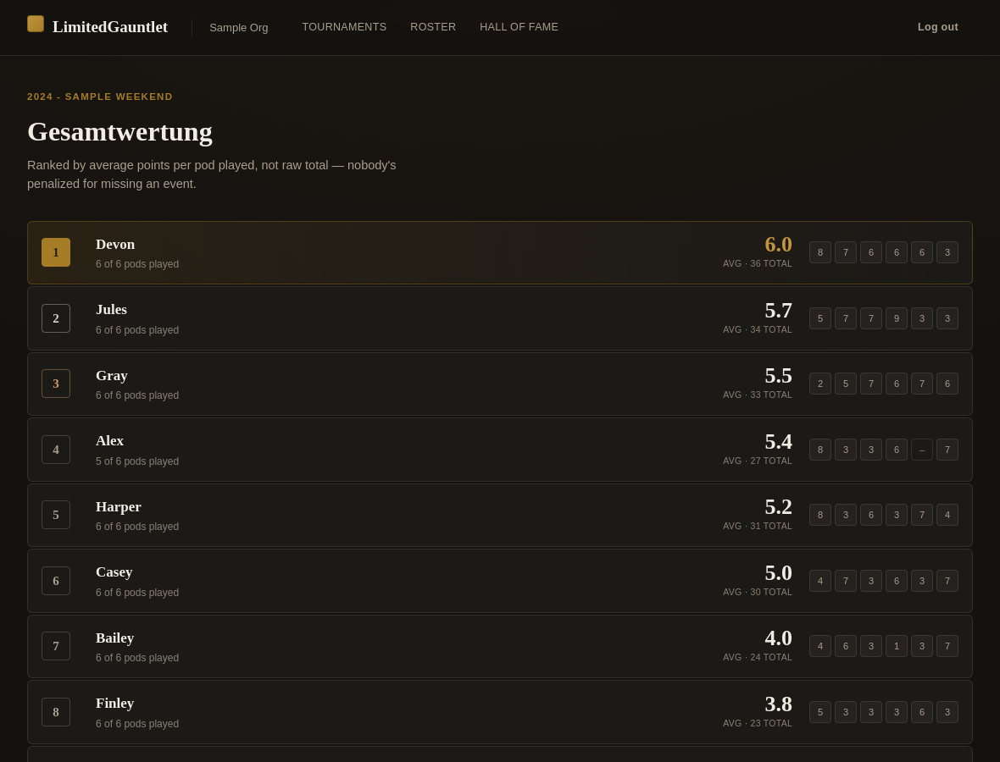

# LimitedGauntlet

A self-hosted, open-source Swiss-tournament tracker for MTG Limited (and other) events. Built to replace a third-party pairing site plus a pile of manually-maintained docs for a yearly weekend GP — pairing, results, live standings, a round timer, card-pull value tracking, and shareable public views, all in one app.

Designed from day one as a real multi-group tool: one deployment can host several isolated organizations, each with their own login, player roster, and public share link.



**Status: solid beta, running in production.** Built over a few days with an AI pair-programmer (Claude Code — see [`PLAN.md`](PLAN.md) for the design rationale and [`docs/BUILD-LOG.md`](docs/BUILD-LOG.md) for the full build log, every entry verified live against a running instance, not just typechecked), then hardened through real weekend-tournament use. Auth/multi-tenancy, Swiss pairing (auto *and* manual, with weekend-wide repeat avoidance and pre-lock swaps), standings, tournament-wide standings, an all-time Hall of Fame, Scryfall-backed card value tracking (the "Treasure Chest"), realtime broadcasts (Socket.IO), a round timer with a Display Mode chime, one-link public read-only sharing per org, and a security-hardened public-exposure posture (rate limiting, closed signup by default, CSP headers, anti-scraping) are all built and browser-tested. Dark mode only for now — light mode is a deliberate v2, not an oversight.

## Features

- **Multi-tenant**: one deployment hosts several independent organizations, each with its own roster, login, and public link.
- **Swiss pairing**: automatic pairing with weekend-wide repeat-opponent avoidance, or hand-pair a round yourself; swap two entrants' seats before a round locks.
- **Live everything**: pairings, standings, and the round timer update over Socket.IO on every connected device — no manual refresh.
- **Standings that actually add up**: per-pod Swiss standings (OMW%/GW%/OGW% tiebreakers, with a manual override for intentional-draw endgames), plus tournament-wide standings ranked by average points per pod (so missing an event doesn't tank your rank).
- **Hall of Fame & Treasure Chest**: an all-time cross-tournament leaderboard (with a longest-win-streak spotlight and main-event crowns), and a Scryfall-backed card-pull value tracker with set/foil-accurate pricing and lightweight auto-attribution for who pulled what.
- **One public link per org**: `/o/<slug>` gives your group a read-only mirror of everything the organizer sees — tournaments, roster, standings, Hall of Fame, Treasure Chest — no login required, and nothing editable.
- **MCP server**: an AI agent can run pairing/results/standings/card-pulls through the same authenticated API the web app uses — see [API tokens & MCP server](#api-tokens--mcp-server) below.
- **Built for public exposure**: rate limiting, a closed-by-default signup form, security headers (CSP/HSTS), anti-scraping headers, and trusted-proxy support out of the box — see [`docs/deployment.md`](docs/deployment.md) for the full exposure guide.

## Stack

Node.js + TypeScript throughout — Fastify + Prisma + PostgreSQL on the backend, React + Vite + Tailwind on the frontend, Socket.IO for realtime. Ships as a single Docker image plus a Postgres container; migrations run automatically on startup.

## Setup

Prerequisites: Docker + Docker Compose (the `docker compose` subcommand, not the old standalone `docker-compose`). Nothing else — Postgres runs in its own container.

**Recommended: run the published image** — no git clone or build step needed, just a Compose file and a `.env`:

```sh
mkdir limitedgauntlet && cd limitedgauntlet
curl -O https://raw.githubusercontent.com/TobiasDax/LimitedGauntlet/main/docker-compose.image.yml
mv docker-compose.image.yml docker-compose.yml
curl -O https://raw.githubusercontent.com/TobiasDax/LimitedGauntlet/main/.env.example
cp .env.example .env
# edit .env: set POSTGRES_PASSWORD and SESSION_SECRET (openssl rand -hex 32)
docker compose up -d
```

See [`docker-compose.image.yml`](docker-compose.image.yml) for the file itself — it defaults to `:latest`, with a comment on pinning a specific version tag instead if you'd rather upgrade deliberately.

**Building from source instead** (only needed if you're modifying the app, or on a platform without a published image):

```sh
git clone https://github.com/TobiasDax/LimitedGauntlet.git
cd LimitedGauntlet
cp .env.example .env
# edit .env: set POSTGRES_PASSWORD and SESSION_SECRET (openssl rand -hex 32)
docker compose up -d --build
```

Either way, the app comes up at `http://localhost:8080` (configurable via `PORT` in `.env`). No manual database setup — migrations apply automatically before the server starts.

**Creating your first account:** signup is closed by default (`ALLOW_SIGNUP=false` in `.env.example`) — this app is meant for an existing group, not an open public signup form. To create your organization, set `ALLOW_SIGNUP=true` in `.env`, restart (`docker compose up -d`), sign up once, then set it back to `false` and restart again. (If you're migrating from spreadsheets/docs instead of starting fresh, see [History import](#history-import) below — it creates your first organization directly, no signup step needed.) Once that first organizer exists, add co-organizers from Settings → Organizers (needs SMTP configured) — no need to reopen signup for teammates.

For a real deployment — production hardening details, reverse proxy / TLS exposure options, updating an existing install — see [`docs/deployment.md`](docs/deployment.md).

## Development

```sh
cp .env.example .env
# edit .env: set POSTGRES_PASSWORD and SESSION_SECRET, as above
docker compose up -d db   # just Postgres, published on localhost:5432 (add a docker-compose.override.yml — see .env.example — since the base file publishes no host port by default)

npm install
npm run dev:server   # Fastify on :8080, loads ../.env for DATABASE_URL etc.
npm run dev:client   # Vite dev server, proxies /api and /socket.io to :8080
```

`npm run prisma:migrate --workspace server` applies schema changes locally against that same Postgres.

```sh
npm run --workspace server test   # server unit/integration tests, needs a live Postgres
npm run --workspace server build && npm run --workspace client build   # typecheck + build both
```

## History import

`server/src/scripts/import-legacy.ts` reads a JSON file of past tournament history — names, pods, points, card pulls — and inserts it via Prisma. It's idempotent (safe to re-run, existing rows are left alone rather than duplicated) and never goes through the HTTP API.

**The data file is not part of this repo.** Real tournament history is real people's names and results, and doesn't belong in a git history — even a private one. Supply your own as `legacy-data.local.json` at the repo root (gitignored) matching the shape in `server/src/scripts/import-legacy.ts`'s `LegacyData` interface, or point at a file anywhere else.

**Building that file by hand is the hard part** — this project ships a Claude Code skill for it: [`import-history`](.claude/skills/import-history/SKILL.md). If you're using Claude Code against this repo, run `/import-history` and describe (or paste) whatever your existing records look like — a spreadsheet, an old pairing site export, Outline/Notion docs, plain notes, screenshots. It knows the exact JSON schema the importer expects, interviews you tournament-by-tournament and pod-by-pod, and validates name/format consistency before writing the file (the importer itself throws on the first bad reference and doesn't roll back what it already inserted, so getting this right up front matters). No Claude Code? The schema and gotchas are all documented in that same skill file — readable on its own even without running it as a skill.

```sh
docker compose exec app node server/dist/scripts/import-legacy.js /path/to/your-data.json
# or: LEGACY_DATA_PATH=/path/to/your-data.json docker compose exec app node server/dist/scripts/import-legacy.js
```

Creates an organization and one organizer login — this is the one path into the app that works regardless of `ALLOW_SIGNUP`. Defaults to an org slugged `gp-eichstaett` (the original author's own group — harmless as a default, but you'll want your own group's details); set these first:

```sh
IMPORT_ORG_SLUG=your-group
IMPORT_ORG_NAME="Your Group's Name"
IMPORT_ORGANIZER_EMAIL=organizer@example.com
IMPORT_ORGANIZER_PASSWORD=              # generated + printed once if left unset — log in and change it
IMPORT_ORGANIZER_NAME=Organizer
```

If you've logged historical card pulls without per-player attribution (or from before that existed), a one-time backfill script guesses attribution for already-completed pods from finish + card value, marking every guess as inferred and reviewable/reassignable — see `docs/deployment.md`'s optional steps.

## API tokens & MCP server

The app exposes an MCP (Model Context Protocol) server (`mcp/`) so an AI agent can read and manage tournament data — pairing, results, standings, card pulls — through the same authenticated API the web app uses, rather than the database directly. Mint a bearer token from **API Tokens** in the top nav (shown once, revoke any time from the same page), then see [`mcp/README.md`](mcp/README.md) for how to run the server and point an MCP client at it. Destructive operations (deleting a tournament/pod/entrant, removing a card pull) require a two-step confirmation in the tool layer, independent of whatever confirmation the MCP client itself also does.

## License

[MIT](LICENSE).
